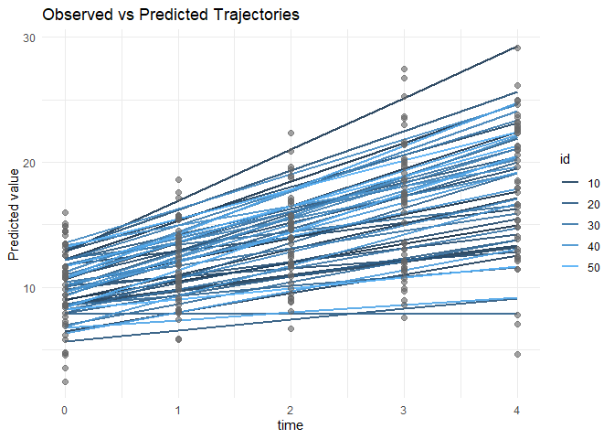
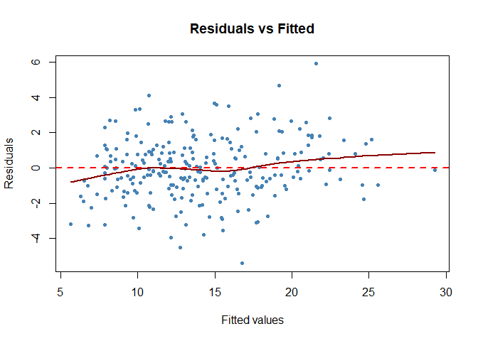
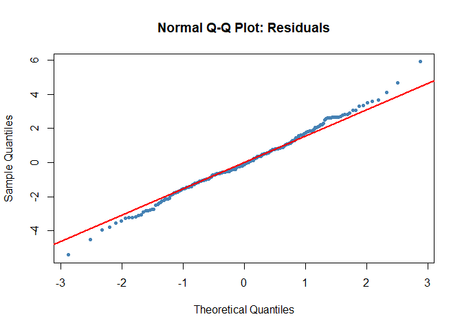

<!-- README.md is generated from README.Rmd. Please edit that file -->

# rcreg: Random Coefficient Regression Models for Repeated Measurements

<!-- badges: start -->

<!-- badges: end -->

## Overview

`rcreg` provides a high-level interface for fitting **random coefficient
regression models** (random intercept and random slope linear mixed
models) for repeated measurement data. The package simplifies the
specification of longitudinal mixed models by wrapping the powerful
`lme4` package, offering convenient functions for:

- Model fitting with intuitive syntax
- Clean summaries of fixed and random effects
- Subject-specific and population-averaged predictions
- Model diagnostics and visualizations
- Data simulation for power analysis and teaching

📖 **For a comprehensive review of random coefficient regression models, see:** [Random Coefficient Regression Models: A Comprehensive Review](review-random-coefficient-models.md)

## Installation

You can install the development version of `rcreg` from GitHub:

``` r
# install.packages("devtools")
devtools::install_github("vanhungtran/rcreg")
```

## Quick Start

``` r
library(rcreg)

# 1. Simulate Data
set.seed(123)
sim_data <- rcr_simulate(n_subjects = 50, n_timepoints = 5, rho = 0.5)
head(sim_data)
#>   id time         x1         y
#> 1  1    0 -0.7104066  9.388917
#> 2  1    1 -0.7104066 11.290666
#> 3  1    2 -0.7104066 12.356129
#> 4  1    3 -0.7104066 11.614113
#> 5  1    4 -0.7104066 15.331103
#> 6  2    0  0.2568837  9.364180

# 2. Fit a random intercept and slope model
mod <- rcr_fit(
  formula = y ~ time + x1,
  data = sim_data,
  id = "id",
  time = "time",
  random = "intercept_slope"
)

# 3. View summary (includes R-squared and ICC)
rcr_summary(mod)
#> Random Coefficient Regression Model Summary
#> ============================================
#> 
#> Call:
#> rcr_fit(formula = y ~ time + x1, data = sim_data, id = "id", 
#>     time = "time", random = "intercept_slope")
#> 
#> Random effects structure: intercept_slope 
#> Random formula: (1 + time | id) 
#> Number of observations: 250 
#> Number of groups (id):50
#> 
#> Fixed Effects:
#>             Estimate Std.Error t.value CI.lower CI.upper
#> (Intercept)   10.297     0.357  28.855    9.597   10.996
#> time           2.057     0.166  12.414    1.732    2.382
#> x1             1.388     0.352   3.948    0.699    2.077
#> 
#> Random Effects Variance Components:
#>        grp        var1 var2  vcov sdcor
#> 1       id (Intercept) <NA> 3.535 1.880
#> 2       id        time <NA> 0.967 0.984
#> 3       id (Intercept) time 0.579 0.313
#> 4 Residual        <NA> <NA> 4.056 2.014
#> 
#> Residual variance: 4.056 
#> Residual std.dev.: 2.014 
#> 
#> Intraclass Correlation Coefficient(s):
#>   intercept: 0.4660.125
#>   slope_var: 0.967
#>   cov_intercept_slope: 0.579
#> R-squared (Nakagawa & Schielzeth):
#>   Marginal (Fixed):     0.547 
#>   Conditional (Total):  0.786 
#> 
#> Model Fit Statistics:
#>   AIC: 1233.25 
#>   BIC: 1257.9 
#>   Log-likelihood: -609.62

# 4. Compare with a simpler model
mod_simple <- rcr_fit(y ~ time + x1, data = sim_data, id = "id", time = "time", random = "intercept")
rcr_compare(mod_simple, mod)
#>   model     random_type      aic      bic    logLik df nobs
#>  model2 intercept_slope 1233.250 1257.900 -609.6248  7  250
#>  model1       intercept 1289.357 1306.964 -639.6784  5  250

# 5. Visualize predictions
rcr_plot_predictions(mod, n_subjects = 10)
#> Warning in predict.merMod(fit, newdata = newdata, re.form = re.form, ...):
#> unused arguments ignored
#> Warning: `aes_string()` was deprecated in ggplot2 3.0.0.
#> ℹ Please use tidy evaluation idioms with `aes()`.
#> ℹ See also `vignette("ggplot2-in-packages")` for more information.
#> ℹ The deprecated feature was likely used in the rcreg package.
#>   Please report the issue at <https://github.com/yourusername/rcreg/issues>.
#> This warning is displayed once every 8 hours.
#> Call `lifecycle::last_lifecycle_warnings()` to see where this warning was
#> generated.
```



``` r

# 6. Diagnostics
rcr_diagnostics(mod, which = c(1, 2))
```



## Key Functions

### Model Fitting & Simulation

- `rcr_fit()`: Fit random coefficient regression models.
- `rcr_simulate()`: Generate simulated longitudinal data.

### Summaries & Inference

- `rcr_summary()`: Comprehensive summary including R-squared.
- `rcr_compare()`: Compare multiple models (AIC, BIC, LRT).
- `rcr_icc()`: Compute Intraclass Correlation Coefficient.
- `rcr_r2()`: Compute Marginal and Conditional R-squared.
- `rcr_ranef()`: Extract random effects.

### Prediction & Visualization

- `rcr_predict()`: Subject-specific or population-averaged predictions.
- `rcr_plot_predictions()`: Visualize subject trajectories.
- `rcr_diagnostics()`: Diagnostic plots.

### Utilities

- `rcr_center_time()`: Center time variables.

## References

- Bates, D., Mächler, M., Bolker, B., & Walker, S. (2015). Fitting
  Linear Mixed-Effects Models Using lme4. *Journal of Statistical
  Software*, 67(1), 1-48.
- Nakagawa, S., & Schielzeth, H. (2013). A general and simple method for
  obtaining R2 from generalized linear mixed-effects models. *Methods in
  Ecology and Evolution*, 4(2), 133-142.

## License

MIT License
